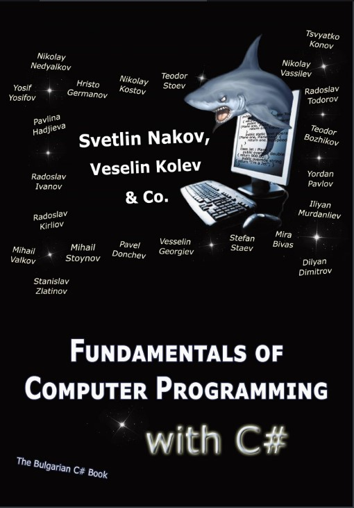
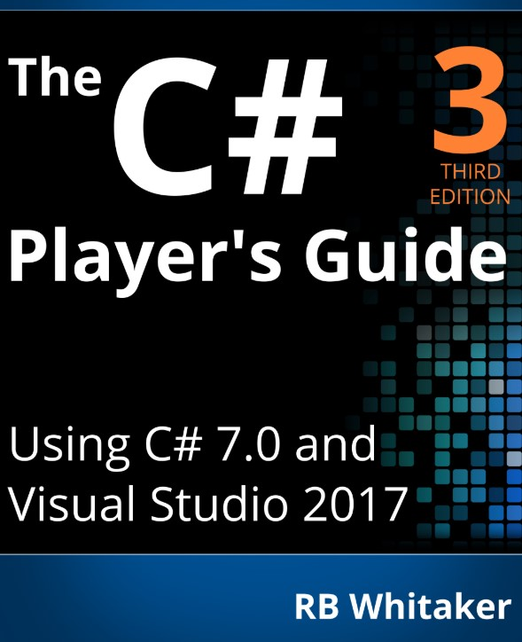

# Notes On C-Sharp   
   
So here's the thing.   

Although C# is nothing short of a $\textit{statically typed, multi-purpose, and  multi-paradigm}$ gift to the world,    
it unfortunately happens to have some of the worst, most non-comprehensive, obnoxiously verbose, and douchiest documentation in the game (Ok, maybe Pascal and/or COBAL might have it beat).
   
However,

The following **two texts** offer, in my oppinion, the most **complete explaination of the C# language** that one can likely find anywhere on the internet.

<table>
    <tbody>
        <tr style="border: none;">
            <td style="border: none;"></img></td>
            <td style="border: none;"></img></td>
        </tr>
    </tbody>
</table>

This repo is a **collection of notes and code examples** inspired by these resources, and brought to life using $.NET\,Interactive$ a.k.a $Polyglot\,Notebooks$ introduced with the release $.NET\,6$.  